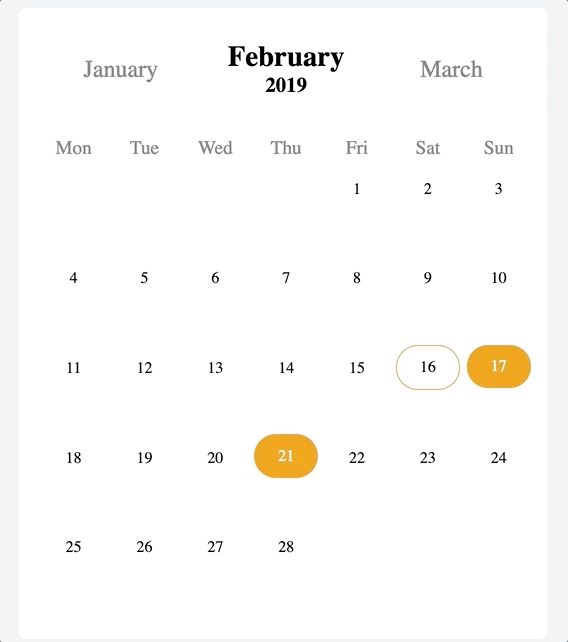

<p align="center">
  
</p>

# React Calendar Events Preview
A Calendar component that marks the events dates.

<p align="center">
  
</p>

## Installation
Run the following command:
`npm install --save react-calendar-events-preview`

## Usage

```js
import EventsCalendar from 'react-calendar-events-preview'

const events = [
    {uuid: '1', date: '10-10-2018'},
    {uuid: '2', date: '12-10-2018'},
]

const MyComponent = props => (
  <div>
    <EventsCalendar 
        events={events}
    />
  </div>
)

```

## Properties

| Props | Default Values | Descriptions |
| --- | --- | --- |
| style | none | Component container styles |
| events | none | list of events (uuid and date field required) |
| color | 'white' | Text color inside a date marker |
| primaryColor | '#616FC6' | Marker backgroud color |
